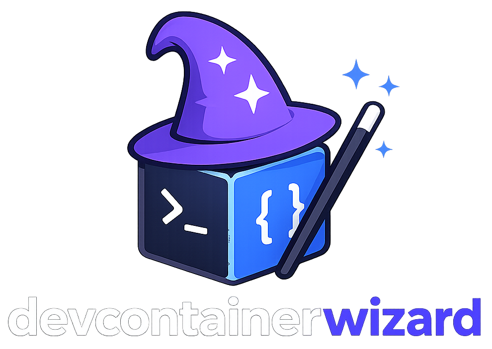

<!-- markdownlint-disable MD033 -->
<p align="center">
  
</p>
<!-- markdownlint-enable MD033 -->

Devcontainerwizard is a CLI to create and manage [Dev Container](https://containers.dev/) configurations. Write a simple `config.yaml`, let the wizard convert it to `devcontainer.json` for you.

## Installation

```bash
go install github.com/lucasassuncao/devcontainerwizard@latest
```

Or build from source:

```bash
git clone https://github.com/lucasassuncao/devcontainerwizard.git
cd devcontainerwizard
go install
```

## Quick start

**1. Create a config.yaml**

```bash
# From a template
devcontainerwizard init -t golang

# Or interactively
devcontainerwizard init -i
```

**2. Edit it (optional)**

```bash
devcontainerwizard edit config.yaml
```

Opens a two-panel TUI to add, remove, and edit blocks without touching the YAML directly.

**3. Generate devcontainer.json**

```bash
devcontainerwizard convert
```

Writes `.devcontainer/devcontainer.json`. Open the project in VS Code and it will prompt you to reopen in container.

## Commands

| Command | Description |
|---------|-------------|
| `init` | Create a new `config.yaml` from a template or interactively |
| `edit` | Open the TUI editor for a config file |
| `convert` | Convert `config.yaml` to `.devcontainer/devcontainer.json` |
| `show-docs` | Browse configuration docs in the terminal |
| `self-update` | Update to the latest release |

## Documentation

- [Command Reference](docs/commands.md)
- [Configuration Reference](docs/configuration.md)
- [Contributing](docs/contributing.md)
- [Model Reference](docs/index.md)

## License

MIT. See [LICENSE](LICENSE).
